

  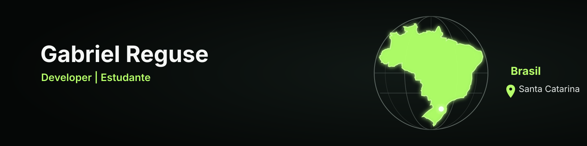

 

## `// selected work`

<table>
  <tr>
    <td width="33%" valign="top">
      <h3>01 — Folium</h3>
      
Educational platform for creating, organizing and improving study materials.

      
<code>React</code> <code>TypeScript</code> <code>FastAPI</code>

      
<a href="./projects/folium.md"><strong>View case study ↗</strong></a>

    </td>
    <td width="33%" valign="top">
      <h3>02 — Certifólio</h3>
      
A platform for organizing courses, certificates and personal progress.

      
<code>React</code> <code>TypeScript</code> <code>Cloudflare</code>

      
<a href="https://github.com/GabrielReguse/certifolio"><strong>View project ↗</strong></a>

    </td>
    <td width="33%" valign="top">
      <h3>03 — INF 25B</h3>
      
A platform built for my class to organize tasks, exams, schedules and communication.

      
<code>JavaScript</code> <code>HTML</code> <code>CSS</code>

      
<a href="https://github.com/GabrielReguse/inf_25b"><strong>View project ↗</strong></a>

    </td>
  </tr>
</table>

 

---

## `// tech stack`

### Front-end

  
  
  
  
  
  
  
  
  
  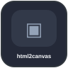
  
  

### Back-end & APIs

  
  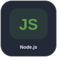
  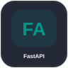
  
  
  
  
  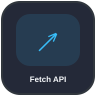
  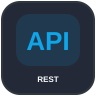
  
  
  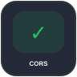

### Databases & Data

  
  
  
  
  
  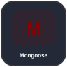
  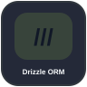
  
  
  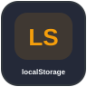

### Auth & Security

  
  
  
  
  
  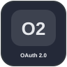
  
  
  
  

### AI & External Services

  
  
  
  
  
  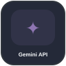
  
  
  
  

### Libraries, PWA & Browser

  
  
  
  
  
  
  
  

### Cloud & Hosting

  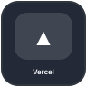
  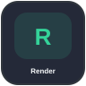
  
  
  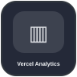
  

### Testing, CI/CD & Tooling

  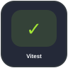
  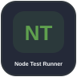
  
  
  
  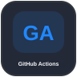
  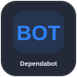
  

### Design & UI/UX

  
  
  
  
  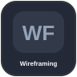
  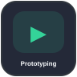
  
  
  
  
  
  
  
  
  
  

 

---

<table>
<tr>
<td width="50%" valign="top">

<h2><code>// currently</code></h2>

🟢 Rebuilding <strong>Folium</strong>

⚪ Improving my front-end and UI/UX skills

⚪ Refining my development workflow

⚪ Turning ideas into real products

</td>
<td width="50%" valign="top">

<h2><code>// beyond code</code></h2>

I'm a developer and student from Brazil interested in web development, interfaces and digital products.

I enjoy learning, experimenting and building things I'd actually use.

<code>Brazil 🇧🇷</code> <code>UTC−3</code> <code>Developer</code> <code>Student</code>

</td>
</tr>
</table>

 

---

## `// github stats`

  
  

 

---

## `// let's connect`

  
  
  

 

  <code>// thanks for visiting</code> &nbsp; build / learn / repeat

