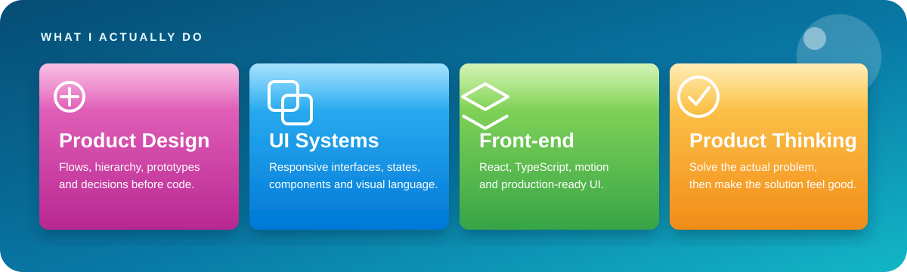
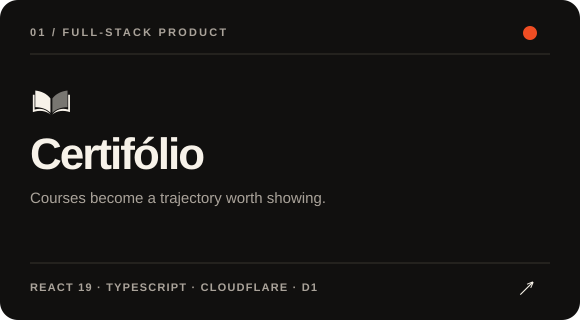
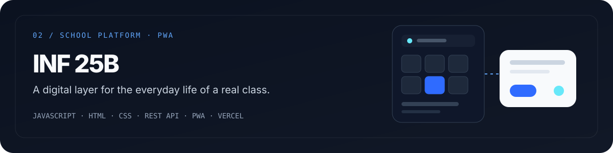
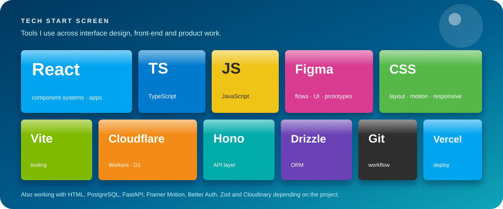
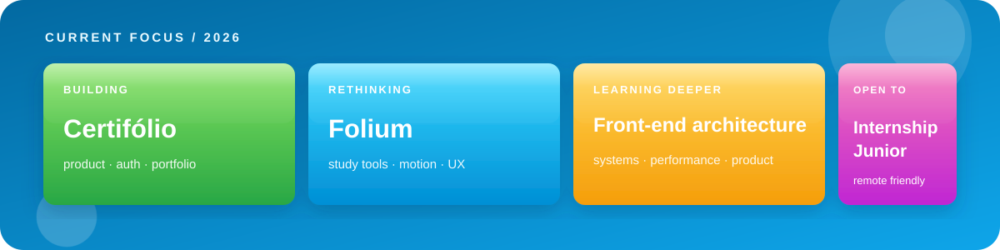

  

  <a href="https://www.linkedin.com/in/gabrielreguse"><b>LinkedIn</b></a>
  &nbsp;&nbsp;•&nbsp;&nbsp;
  <a href="mailto:gabrielreguse1@gmail.com"><b>Email</b></a>
  &nbsp;&nbsp;•&nbsp;&nbsp;
  <a href="https://github.com/GabrielReguse?tab=repositories"><b>Repositories</b></a>
  &nbsp;&nbsp;•&nbsp;&nbsp;
  <a href="./projects/folium.md"><b>Folium case study</b></a>

 

<table>
<tr>
<td width="64%" valign="top">

### Design and code belong in the same loop.

I'm **Gabriel Reguse**, an Informatics student at **IFC** in Brazil. I like projects where I can understand the problem, shape the experience, design the interface and still be the person who turns it into a working product.

Most of my work lives between **front-end development, UI/UX and product design**. I care about visual hierarchy, responsive behavior, motion, accessibility and the less-visible architecture that keeps an interface maintainable after the first pretty screen.

</td>
<td width="36%" valign="top">

### At a glance

**Based in** — Brazil  
**Studying** — Informatics @ IFC  
**Focus** — Front-end · UI/UX · Product  
**Main stack** — React · TypeScript  
**Open to** — Internship / Junior roles

</td>
</tr>
</table>

 

  

 

## Selected work

**Certifólio** is a full-stack platform for organizing courses, certificates and learning goals, then turning them into a professional public profile with selective visibility and protected files.

`React 19` · `TypeScript` · `Vite` · `Hono` · `Cloudflare Workers` · `D1` · `Drizzle` · `Better Auth` · `Zod` · `Cloudinary`

**→ [Open repository](https://github.com/GabrielReguse/certifolio)**

 

**INF 25B** started as a way to organize my class routine and grew into a shared platform for assignments, exams, calendar, announcements, conversations, events, notifications and administration.

`JavaScript` · `HTML` · `CSS` · `REST API` · `PWA` · `Service Worker` · `Vercel` · `GitHub Actions`

**→ [Open repository](https://github.com/GabrielReguse/inf_25b)**

 

**Folium** is my learning-product experiment: mind maps, presentations and study sheets with templates, editing, motion and AI-assisted generation that stays under the user's control. The codebase is private, so I keep a public case study instead.

`React 19` · `TypeScript` · `Vite` · `Framer Motion` · `Chart.js` · `FastAPI` · `PostgreSQL` · `AI providers with fallback`

**→ [Read the public case study](./projects/folium.md)**

 

  

<table>
<tr>
<td width="25%" valign="top">

### Interface

Figma  
CSS / responsive UI  
Design systems  
Motion & microinteractions

</td>
<td width="25%" valign="top">

### Front-end

React  
TypeScript  
JavaScript  
Vite

</td>
<td width="25%" valign="top">

### Back-end & data

Hono  
Cloudflare Workers / D1  
Drizzle ORM  
FastAPI / PostgreSQL

</td>
<td width="25%" valign="top">

### Product & delivery

Git / GitHub  
Vercel  
Cloudinary  
Auth, validation & CI

</td>
</tr>
</table>

 

  

 

## How I like to build

<table>
<tr>
<td width="25%" valign="top">

### ① Understand

Start from the actual annoyance, workflow or user need — not from a component library.

</td>
<td width="25%" valign="top">

### ② Design

Define hierarchy, states, flows and visual language before polishing individual screens.

</td>
<td width="25%" valign="top">

### ③ Build

Turn the system into responsive, accessible components and keep the implementation close to the design intent.

</td>
<td width="25%" valign="top">

### ④ Refine

Test the awkward states, remove friction, tune motion and keep changing the parts that still feel wrong.

</td>
</tr>
</table>

 

---

### Have something that deserves a better interface?

**[Email me](mailto:gabrielreguse1@gmail.com)** &nbsp;&nbsp;•&nbsp;&nbsp; **[LinkedIn](https://www.linkedin.com/in/gabrielreguse)** &nbsp;&nbsp;•&nbsp;&nbsp; **[Browse my repositories](https://github.com/GabrielReguse?tab=repositories)**

Gabriel Reguse · Front-end · UI/UX · Product · Brazil

