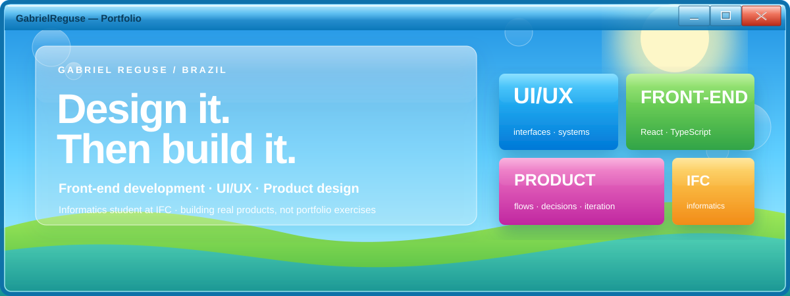

  

  <a href="https://www.linkedin.com/in/gabrielreguse">LinkedIn</a>
  &nbsp;&nbsp;·&nbsp;&nbsp;
  <a href="mailto:gabrielreguse1@gmail.com">Email</a>
  &nbsp;&nbsp;·&nbsp;&nbsp;
  <a href="https://github.com/GabrielReguse?tab=repositories">Repositories</a>

 

Gosto de pegar coisas que parecem **mais complicadas, feias ou chatas do que deveriam** e tentar fazer uma versão melhor.

Na maioria das vezes isso vira interface. Às vezes vira um projeto inteiro.

Hoje estudo Informática no **IFC** e concentro meu trabalho em front-end, UI/UX e produto.

 

## Selected work

### [Certifólio](https://github.com/GabrielReguse/certifolio) ↗

**Cursos e certificados virando uma trajetória que realmente dá vontade de mostrar.**

Certificados normalmente acabam espalhados entre pastas, e-mails e links. O Certifólio nasceu para colocar tudo em um lugar só, sem transformar isso em outra planilha glorificada.

`React 19` &nbsp; `TypeScript` &nbsp; `Hono` &nbsp; `Cloudflare Workers` &nbsp; `D1` &nbsp; `Drizzle`

 

### [INF 25B](https://github.com/GabrielReguse/inf_25b) ↗

**Um sistema construído em volta da rotina real da minha turma.**

Começou como um lugar para organizar tarefas e avisos. Cresceu para provas, calendário, eventos, conversas, administração, notificações e PWA conforme novos problemas apareciam.

`JavaScript` &nbsp; `HTML` &nbsp; `CSS` &nbsp; `REST API` &nbsp; `PWA` &nbsp; `Vercel`

 

### Folium

**Ferramentas de estudo que não precisam parecer software escolar.**

Mapas mentais, apresentações e materiais visuais com bastante foco em personalização, clareza e experiência de uso.

`Product Design` &nbsp; `UI/UX` &nbsp; `Front-end`

 

---

## What I use

<table>
<tr>
<td width="50%" valign="top">

**No dia a dia**

React · TypeScript · JavaScript · CSS · Figma

</td>
<td width="50%" valign="top">

**Também aparecem bastante**

Cloudflare · Hono · D1 · Drizzle · Vite · Git · Vercel

</td>
</tr>
</table>

 

---

## Now

Construindo o **Certifólio**.  
Repensando o **Folium**.  
Estudando mais sobre arquitetura de front-end e produto.

E, provavelmente, redesenhando alguma coisa que já funcionava perfeitamente.

 

  Gabriel Reguse · Brazil · <a href="mailto:gabrielreguse1@gmail.com">gabrielreguse1@gmail.com</a>

