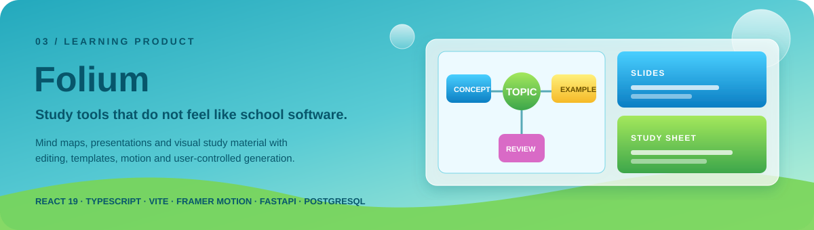

# Folium — public case study

<p align="center">
  
</p>

> The main Folium repository is private. This page documents the product idea, the design direction and the technical shape of the project without publishing the source code.

## The problem

Study software often lands in one of two places: it is functional but visually forgettable, or it spends so much effort looking playful that the interface becomes another thing the student has to manage.

**Folium** is my attempt to sit between those extremes.

The product focuses on creating **mind maps, presentations and study sheets** with enough automation to remove repetitive work, but enough manual control that the output does not feel locked or generic.

## What I am exploring

<table>
<tr>
<td width="33%" valign="top">

### Mind maps

Topic generation, editable ordering, layout choices and visual customization after the first result.

</td>
<td width="33%" valign="top">

### Presentations

Context-driven slide generation, templates, manual editing and export-oriented flows.

</td>
<td width="33%" valign="top">

### Study sheets

Visual material that remains readable, editable and useful instead of becoming a static AI output.

</td>
</tr>
</table>

## Design direction

The main design challenge is balancing **personality and calm**.

I want Folium to feel like a product someone chose to use, not a school portal they were forced to open. At the same time, the interface should get out of the way once the student is actually reading or editing material.

That leads to a few rules:

- creation flows can be expressive; study views should be quieter;
- templates should provide a strong starting point without removing control;
- animation should explain hierarchy and state, not decorate every click;
- mobile layouts should be redesigned for the smaller space, not merely compressed;
- generated content should always be editable after generation.

## Current technical shape

### Front-end

`React 19` · `TypeScript` · `Vite` · `Framer Motion` · `Chart.js` · `html2canvas` · `jsPDF`

### Back-end

`Python` · `FastAPI` · `PostgreSQL` · JWT-based authentication · multiple AI providers with fallback

### Quality

The project includes Vitest and Node test suites covering areas such as:

- study-sheet generation;
- AI provider behavior and fallback;
- image search;
- library synchronization and storage;
- mind-map layout;
- presentation export locking.

## The workflow I want

```text
context
   │
   ▼
structure / generation
   │
   ▼
visual template
   │
   ▼
manual editing
   │
   ▼
export / library
```

The important part is the middle: automation creates a useful first version, but the user remains responsible for the final structure and appearance.

## What this project demonstrates

Folium is where I push further into **product design, complex front-end flows, motion, state management and generation-heavy interfaces** than my smaller projects usually require.

It is also the project where I am most willing to redesign a working feature when the experience still feels wrong.

---

<p align="center">
  <b>Useful first. Visual second. Ideally both.</b><br>
  <a href="../README.md">← Back to profile</a>
</p>
